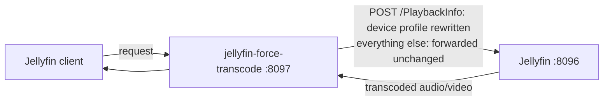

# jellyfin-force-transcode

[](https://github.com/Forward-Tonight7079/jellyfin-force-transcode/actions/workflows/docker.yml)
[](https://github.com/Forward-Tonight7079/jellyfin-force-transcode/releases)
[](https://github.com/Forward-Tonight7079/jellyfin-force-transcode/pkgs/container/jellyfin-force-transcode)
[](LICENSE)

jellyfin-force-transcode is a small reverse proxy. It makes your Jellyfin server **transcode audio,
video, or both**, for the clients that you select. Use it for the cases that Jellyfin cannot control
from the server. It is not a plugin. It does not change Jellyfin. It does not change your media files.

## Contents

- [Why this exists](#why-this-exists) · [Do you even need this?](#do-you-even-need-this)
- [What it solves](#what-it-solves-common-cases) · [How it works](#how-it-works) · [Compatibility](#compatibility)
- [Quick start](#quick-start) · [Configuration](#configuration-rulesjson) · [Logging](#logging)
- [Troubleshooting](#troubleshooting) · [License](#license)

## Why this exists

Jellyfin decides to **transcode** or to **direct-play** from the *client's* device profile. Jellyfin
trusts the client. Two things are still difficult to force from the server:

- **Force audio to stereo.** In the past, Jellyfin ignored the setting "Maximum Allowed Audio
  Channels" for direct play ([jellyfin-web#5715](https://github.com/jellyfin/jellyfin-web/issues/5715)).
  Jellyfin 10.9.11 corrected this, so the setting now applies to direct play. But the user must enable
  it, and the client must show it. Some clients (for example, the Android app with the ExoPlayer
  player) still tell the server that they support multichannel audio. The server then copies the
  audio. Devices with stereo speakers then freeze or give no sound on 5.1 or 7.1 audio. A related
  report is closed as *not planned* ([jellyfin#11002](https://github.com/jellyfin/jellyfin/issues/11002)).
- **Force one device to transcode video.** Jellyfin has no setting to always transcode for one client.
  You can only disable transcoding for a user, and then playback **fails**; it does not transcode
  ([docs](https://jellyfin.org/docs/general/post-install/transcoding/)). Or you can set one global
  bitrate limit. So a device that direct-plays a codec badly (for example, a Fire TV that stutters on
  HEVC, [forum](https://forum.jellyfin.org/t-force-trasnscoding-or-disable-directplay-x265-stuttering-firetv))
  has no clean fix for one device.

This proxy changes only one request — the request where this negotiation occurs (`PlaybackInfo`). The
server then transcodes what you specify — audio, video, or both — for the clients that you select.

> I made this tool because a kids' tablet froze on every movie with 5.1 or 7.1 audio. I did not want
> to re-encode all my files.

### Do you even need this?

You may not need it. First, examine the built-in options:

- If your client shows a **"Maximum allowed audio channels"** setting, and it corrects your audio, use
  it. Jellyfin 10.9.11 and later apply it to direct play.
- If a per-user **streaming bitrate limit** is sufficient, set it in Jellyfin.

Use this proxy when those options are not available or not sufficient. For example:

- The client has no such setting.
- You want the server to force the setting for all clients.
- You need different settings for each device or each user.
- You must force video transcoding (resolution or bitrate). No built-in setting does this.

## What it solves (common cases)

- **Multichannel audio freezes or gives no sound** — force a stereo downmix.
- **Stereo-only speakers** — always downmix to 2 channels.
- **A device stutters or fails on a codec that it reports as supported** — force it to transcode video.
- **Playback buffers on a slow or remote link** — set a bitrate limit, so the server transcodes down.
- **Small screens** — set a resolution limit (for example, 720p) instead of full resolution.
- **Any client, not only the Android app** — this includes players that give you no setting for
  channels, bitrate, or resolution.

## How it works

**Stack:** one Docker container. It runs [mitmproxy](https://mitmproxy.org/) in reverse-proxy mode
with a small Python addon. There is nothing else.



- The proxy sends all requests to Jellyfin without changes, except `POST .../PlaybackInfo`.
- For that request, the addon rewrites the client's `DeviceProfile`. It can limit audio channels,
  video width, and bitrate. It changes only the values that you set. Audio and video are independent.
- Jellyfin then reads the changed profile and **transcodes**.
- Video segments, WebSocket, and images pass through without changes.
- **Neutral and fail-safe:** with no rules, the proxy changes nothing. On any error, it sends the
  request through without changes. The proxy never stops playback.

## Compatibility

- Tested with **Jellyfin 12.1.0**.
- The proxy uses only the standard `POST /Items/{id}/PlaybackInfo` negotiation. Jellyfin has used it
  for years, so it should also work with **Jellyfin 10.x and later**.
- If a later Jellyfin release changes the PlaybackInfo format and the proxy stops working, open an
  issue.

## Quick start

You need Docker. **The proxy changes nothing until you configure it.** You specify what to force in a
small `rules.json`.

Do these steps:

1. Create a `rules.json`. This example forces one client to stereo, and limits it to 1080p and 8 Mbps:

   ```json
   { "rules": [ { "name": "fire-tv",
                  "match": { "client": "Jellyfin Android TV" },
                  "max_audio_channels": 2, "max_width": 1920, "max_bitrate": 8000000 } ] }
   ```

   More examples (stereo for all clients, video only for one device, several profiles) are in
   [Configuration](#configuration-rulesjson) below.

2. Start the container. Mount your file:

   ```bash
   docker run -d --name jellyfin-force-transcode \
     -p 8097:8080 \
     -e JELLYFIN_URL=http://192.168.1.50:8096 \
     -v "$(pwd)/rules.json:/addon/rules.json:ro" \
     --restart unless-stopped \
     ghcr.io/forward-tonight7079/jellyfin-force-transcode:latest
   ```

   Or use Docker Compose (Portainer or Dockge):

   ```yaml
   services:
     jellyfin-force-transcode:
       image: ghcr.io/forward-tonight7079/jellyfin-force-transcode:latest
       environment:
         JELLYFIN_URL: "http://192.168.1.50:8096"   # your Jellyfin address
       ports:
         - "8097:8080"
       volumes:
         - ./rules.json:/addon/rules.json:ro
       restart: unless-stopped
   ```

3. In the client, set the **server address** to `http://<docker-host-ip>:8097`.

### Verify it works

Play a title on that client. Then open Jellyfin **Dashboard → Playback** (active streams), or read the
server log. You must see a transcode with the limit that you set — for example, `-ac 2` for stereo, or
`scale` / `-maxrate` for video. If the client direct-plays, the rule did not match. Check the client
name (see below).

## Configuration (rules.json)

`rules.json` is the only place that defines the behaviour. `JELLYFIN_URL` (an environment variable) is
only the address of your Jellyfin. This example has several profiles:

```json
{
  "rules": [
    { "name": "kids-account-any-device",
      "match": { "user_id": "3f2a1b4c5d6e7f8091a2b3c4d5e6f708" },
      "max_audio_channels": 2 },

    { "name": "any-android-app",
      "match": { "client": "/Android/" },
      "max_audio_channels": 2, "max_width": 1280, "max_bitrate": 6000000 },

    { "name": "fire-tablet-force-10bit-hevc",
      "match": { "client": "Jellyfin Android TV" },
      "max_video_bit_depth": 8 },

    { "name": "living-room-tv",
      "match": { "device_id": "a1b2c3d4e5f60718293a4b5c6d7e8f9012345678" },
      "max_bitrate": 20000000 },

    { "name": "everything-else",
      "match": {},
      "max_audio_channels": 2 }
  ]
}
```

**Transforms** — set only the fields that you want. Audio and video are independent:

| Field | Effect |
|---|---|
| `max_audio_channels` | Downmix target. `2` = stereo. Forces **audio** transcode. Omit it to keep the audio. |
| `keep_audio_codecs` | Codecs that a client may still direct-play (default `aac,mp3`). Used only with `max_audio_channels`. |
| `max_bitrate` | Limit for the total stream bitrate, in bits per second (for example, `6000000`). Forces **video** transcode when the source is higher. |
| `max_width` | Limit for the transcode width, in pixels (for example, `1280` = 720p). Forces a downscale for wider video. |
| `max_video_bit_depth` | Limit for the video bit depth (for example, `8`). Forces **video** transcode when the source is deeper, such as 10-bit HEVC. |
| `keep_video_codecs` | Video codecs that a client may direct-play (for example, `h264`). Other codecs are transcoded. |

A rule with none of these fields does nothing.

### How matching works

For each `POST .../PlaybackInfo` request, the addon reads four values from the request:

| Match key | Taken from |
|---|---|
| `client` | the `Client="..."` field of the Authorization header (for example, `Jellyfin for Android`, `Jellyfin Android TV`, `Jellyfin Web`, `Findroid`) |
| `device_id` | the `DeviceId="..."` field of the Authorization header — one device install |
| `user_agent` | the `User-Agent` header |
| `user_id` | the Jellyfin user — the `userId` query parameter (or `UserId` in the body) |

The addon then reads the `rules` list from top to bottom. It applies the **first** rule whose `match`
fits, and then it stops. A `match` fits only when **every** key in it matches (logical AND). An empty
`match: {}` matches all clients. Put such a rule **last**, as a catch-all. If no rule matches, the
request passes through without changes.

**The addon compares each value in one of two ways:**

- **A plain string is an exact match.** `"client": "Jellyfin for Android"` matches only that client.
- **A `/regex/` value is a regular expression** (Python `re.search`, so it matches at any position in
  the value; this also gives a "contains" match). Add flags after the last slash; `i` means that the
  case does not matter:
  - `"client": "/Android/"` matches `Jellyfin for Android` and `Jellyfin Android TV`
  - `"user_agent": "/okhttp/i"` — the case does not matter
  - `"device_id": "/^abc123/"` — starts with `abc123`

A bad regular expression does not stop playback. It does not match, and the proxy writes a warning.

**Where to find the values.** The surest source is the log. Start the proxy with `LOG=events`, play
one title on the device, and read the `PlaybackInfo from …` line (see [Logging](#logging)). It prints
the exact `client`, `device_id`, and `user_id` that the proxy parsed. Copy these values into your
`match`. The Jellyfin dashboard can show a different string, so prefer the log.

The dashboard is still a good reference. The client name and the DeviceId are in **Dashboard →
Devices**. The user id is in **Dashboard → Users** (open the user; the id is in the page address).
Example formats:

- `client`: `Jellyfin for Android`, `Jellyfin Android TV`, `Jellyfin Web`, `Findroid`, `Moonfin for Android`
- `device_id` — an opaque value, one for each install: 40-character hex (Android TV), hex plus a
  partial GUID (Android app), 16-character hex (Findroid), a UUID (Moonfin), a long base64 string (Web)
- `user_id` — a 32-character hex id, for example `3f2a1b4c5d6e7f8091a2b3c4d5e6f708`
- `user_agent`:
  - `Jellyfin for Android/2.7.3 (Linux;Android 16) AndroidXMedia3/1.8.0` — the video player of the app
  - `Jellyfin for Android/2.7.3 via jellyfin-sdk-kotlin (OkHttp/4.12.0)` — the API calls of the app
  - `Mozilla/5.0 (...) Chrome/153.0.0.0 Safari/537.36` — a browser, that is, Jellyfin Web

The addon re-reads the file when it changes. You do not need to restart. To use a different path for
the rules file, set `RULES_FILE`.

## Logging

The container writes its logs to stdout. Read them with `docker logs -f jellyfin-force-transcode`. The
`LOG` environment variable sets how much the proxy writes:

| `LOG` | Output |
|---|---|
| `events` (default) | Only the important lines: startup, `loaded N rule(s)`, each new `PlaybackInfo from …` identity, each `rewrote PlaybackInfo …`, and warnings. It stays quiet on a busy server. |
| `full` | Everything that mitmproxy sees — one line for each request (this includes video segments). Use it to debug. |
| `quiet` | Silent (errors only). |

In `events` mode the proxy writes two useful lines:

```
jft: PlaybackInfo from client='Jellyfin for Android' device_id='a1b2…' user_id='3f2a…' user_agent='…'
jft: rewrote PlaybackInfo rule=kids-tablet (maxch=2 keepac=aac,mp3 maxw=1344 maxbr=6000000 maxbits=8) client='Jellyfin for Android'
```

- The **`PlaybackInfo from …`** line prints one time for each new client. It shows the exact values that
  the proxy parsed. **Copy these values into a rule `match`.** They can differ from the Jellyfin
  dashboard, so this line is the surest source.
- The **`rewrote PlaybackInfo …`** line shows which rule matched and every cap that it applied.

The proxy writes only the rule name, the parsed identity, and the caps that it applied. It never writes
tokens, credentials, or media content. Docker rotates the logs (with the standard `json-file` driver),
so they do not grow without a limit.

## Troubleshooting

**The client direct-plays. Nothing transcodes.** The rule did not match. Set `LOG=events`. Look for a
`rewrote PlaybackInfo` line. If it is not there, find the `PlaybackInfo from …` line instead. It shows
the exact `client` and `device_id` that the proxy parsed. Copy those values into your `match`. A plain
`client` value must be an exact match; or use a `/regex/`.

**The audio is still multichannel.** Make sure that the matched rule sets `max_audio_channels`. A
video-only rule keeps the audio. Also confirm that the traffic goes through the proxy. The client's
server address must be `http://<host>:8097`, not Jellyfin directly.

**The app cannot connect.** Confirm that the container runs. Confirm that `JELLYFIN_URL` points to a
reachable Jellyfin (`http://IP:8096`). For HTTPS or remote access, make sure that your outer reverse
proxy forwards WebSockets.

**How do I confirm that it works?** Play a title. Then open **Dashboard → Playback** (active streams),
or read the server log. You must see a transcode with your limit (`-ac 2`, or `scale` / `-maxrate` for
video).

**Playback stopped after a Jellyfin upgrade.** The PlaybackInfo format may have changed. Set
`LOG=full`. Capture a `POST .../PlaybackInfo`. Then open an issue.

## Notes and caveats

- The proxy is now between the client and Jellyfin. It uses `restart: unless-stopped`. If it stops,
  point the client at Jellyfin directly.
- The proxy does not store or log credentials. It edits only the `PlaybackInfo` body, and it forwards
  the rest.
- Do not expose the plain HTTP port to the internet. For remote access, put the proxy behind your own
  TLS reverse proxy with WebSocket support, then point the client at that hostname.
- After a Jellyfin upgrade, confirm that the proxy still forces transcoding. If the PlaybackInfo
  format changed, open an issue.
- The proxy does not change your media files.

## Why not a Jellyfin plugin?

A Jellyfin plugin cannot change the PlaybackInfo negotiation for app clients. The server makes that
decision from the client's device profile, and it trusts the client. A proxy is the only place to
change the profile without a change to Jellyfin.

## License

MIT. See [LICENSE](LICENSE).
