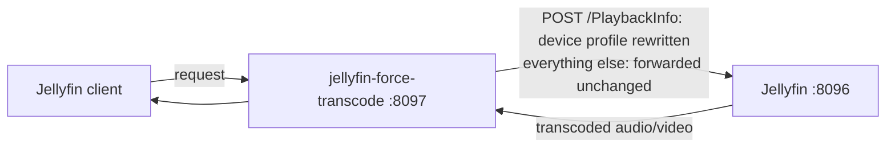

# jellyfin-force-transcode

[](https://github.com/Forward-Tonight7079/jellyfin-force-transcode/actions/workflows/docker.yml)
[](https://github.com/Forward-Tonight7079/jellyfin-force-transcode/releases)
[](https://github.com/Forward-Tonight7079/jellyfin-force-transcode/pkgs/container/jellyfin-force-transcode)
[](LICENSE)

A small reverse proxy that **forces your Jellyfin server to transcode audio and/or video** for the
clients you choose — for cases Jellyfin still cannot handle from the server side. No plugin, no fork,
no changes to your media files.

## Contents

- [Why this exists](#why-this-exists) · [Do you even need this?](#do-you-even-need-this)
- [What it solves](#what-it-solves-common-cases) · [How it works](#how-it-works) · [Compatibility](#compatibility)
- [Quick start](#quick-start) · [Configuration](#configuration-rulesjson) · [Logging](#logging)
- [Troubleshooting](#troubleshooting) · [Remote access / HTTPS](#remote-access--https) · [License](#license)

## Why this exists

Jellyfin decides whether to **transcode** or **direct-play** from the *client's* device profile, and
it trusts the client. Two things are still hard to force from the server:

- **Downmix audio to stereo.** Jellyfin used to ignore "Maximum Allowed Audio Channels" for direct
  play ([jellyfin-web#5715](https://github.com/jellyfin/jellyfin-web/issues/5715)); that was fixed in
  **10.9.11**, so the setting now applies to direct play — but only if the user explicitly enables
  it, and only where the client exposes it. In practice some clients (for example the Android app's
  integrated ExoPlayer) still advertise multichannel, the server copies it, and devices with stereo
  speakers freeze or lose sound on 5.1 / 7.1. A related report was closed as *not planned*
  ([jellyfin#11002](https://github.com/jellyfin/jellyfin/issues/11002)).
- **Force a specific device to transcode video.** There is no native "always transcode this client".
  You can only *disable* transcoding per user — and then playback **fails** instead of transcoding
  ([docs](https://jellyfin.org/docs/general/post-install/transcoding/)) — or set a global bitrate
  limit. So a device that direct-plays a codec badly (a Fire TV stuttering on HEVC,
  [forum](https://forum.jellyfin.org/t-force-trasnscoding-or-disable-directplay-x265-stuttering-firetv))
  has no clean per-device fix.

This proxy rewrites the one request where that negotiation happens (`PlaybackInfo`), so the server
transcodes exactly what you tell it to — audio, video, or both — for exactly the clients you choose.

> I built it because a kids' tablet froze on every 5.1 / 7.1 movie and I did not want to re-encode my
> whole library.

### Do you even need this?

Maybe not — check the built-in options first:

- If your client exposes a **"Maximum allowed audio channels"** setting and honoring it fixes your
  audio, use that (Jellyfin 10.9.11+ applies it to direct play).
- If a per-user **streaming bitrate limit** is enough, set it in Jellyfin.

Reach for this proxy when those are not available or not enough: the client has **no such setting**,
you want it enforced **server-side regardless of the client**, you need it **per device / per user**,
or you need to **force video** (resolution/bitrate) transcoding, which no native setting does.

## What it solves (common cases)

- **Multichannel audio freezes or plays silent** — force a stereo downmix.
- **Stereo-only speakers** — always downmix to 2 channels.
- **A device stutters or fails on a codec it "supports"** — force it to transcode video.
- **Buffering on slow or remote links** — cap the bitrate so the server transcodes down.
- **Small screens** — cap the resolution (e.g. 720p) instead of sending full-res.
- **Any client, not just the Android app** — including players that give you no way to limit channels,
  bitrate or resolution themselves.

## How it works

**Stack:** one Docker container — [mitmproxy](https://mitmproxy.org/) in reverse-proxy mode plus a
small Python addon. Nothing else.



- Everything is forwarded to Jellyfin unchanged, except `POST .../PlaybackInfo`.
- On that request the addon rewrites the client's `DeviceProfile`: it can cap audio channels, video
  width and bitrate — **only the ones you set**, independently of each other.
- Jellyfin then evaluates the modified profile and **transcodes** accordingly.
- Video segments, WebSocket and images stream through untouched.
- **Neutral and fail-safe:** with no rules it changes nothing, and any error passes the request
  through unchanged, so playback never breaks because of the proxy.

## Compatibility

- Tested with **Jellyfin 12.1.0**.
- It uses only the standard `POST /Items/{id}/PlaybackInfo` device-profile negotiation, which Jellyfin
  has used for years, so it is expected to work on **Jellyfin 10.x and newer**.
- If a future release changes the PlaybackInfo schema and forcing stops working, please open an issue.

## Quick start

You need Docker. **Out of the box the proxy changes nothing** — you tell it what to force with a
small `rules.json`.

1. Create a `rules.json`. For example — force one client to stereo **and** cap it to 1080p / 8 Mbps:

   ```json
   { "rules": [ { "name": "fire-tv",
                  "match": { "client": "Jellyfin Android TV" },
                  "max_audio_channels": 2, "max_width": 1920, "max_bitrate": 8000000 } ] }
   ```

   More recipes — stereo for everyone, video-only for one device, several profiles at once — are in
   [Configuration](#configuration-rulesjson) below.

2. Run it, mounting your file:

   ```bash
   docker run -d --name jellyfin-force-transcode \
     -p 8097:8080 \
     -e JELLYFIN_URL=http://192.168.1.50:8096 \
     -v "$(pwd)/rules.json:/addon/rules.json:ro" \
     --restart unless-stopped \
     ghcr.io/forward-tonight7079/jellyfin-force-transcode:latest
   ```

   Or Docker Compose (Portainer / Dockge):
   ```yaml
   services:
     jellyfin-force-transcode:
       image: ghcr.io/forward-tonight7079/jellyfin-force-transcode:latest
       environment:
         JELLYFIN_URL: "http://192.168.1.50:8096"   # your Jellyfin address
       ports:
         - "8097:8080"
       volumes:
         - ./rules.json:/addon/rules.json:ro
       restart: unless-stopped
   ```

3. In the client, set the **server address** to `http://<docker-host-ip>:8097`.

### Verify it works

Play something on that client, then open Jellyfin **Dashboard → Playback** (active streams) or the
server log. You should see a transcode with the cap you set — for example `-ac 2` for stereo, or a
`scale` / `-maxrate` for the video cap. If it direct-plays, the rule did not match — check the client
name (see below).

## Configuration (rules.json)

`rules.json` is the only place behaviour is defined; `JELLYFIN_URL` (env) is just the upstream
address. Example with several profiles:

```json
{
  "rules": [
    { "name": "kids-account-any-device",
      "match": { "user_id": "3f2a1b4c5d6e7f8091a2b3c4d5e6f708" },
      "max_audio_channels": 2 },

    { "name": "any-android-app",
      "match": { "client": "/Android/" },
      "max_audio_channels": 2, "max_width": 1280, "max_bitrate": 6000000 },

    { "name": "living-room-tv",
      "match": { "device_id": "a1b2c3d4e5f60718293a4b5c6d7e8f9012345678" },
      "max_bitrate": 20000000 },

    { "name": "everything-else",
      "match": {},
      "max_audio_channels": 2 }
  ]
}
```

**Transforms** — set only the ones you want; audio and video are independent:

| Field | Effect |
|---|---|
| `max_audio_channels` | Downmix target, `2` = stereo. Forces **audio** transcode. Omit to leave audio alone. |
| `keep_audio_codecs` | Codecs a client may still direct-play (default `aac,mp3`); only used together with `max_audio_channels`. |
| `max_bitrate` | Cap total stream bitrate in bits/s, e.g. `6000000`. Forces **video** transcode when the source is higher. |
| `max_width` | Cap transcode width in pixels, e.g. `1280` (720p). Forces a downscale for wider video. |

A rule with none of these fields does nothing.

### How matching works

For every `POST .../PlaybackInfo` request the addon builds four values from the request:

| Match key | Taken from |
|---|---|
| `client` | the `Client="..."` field of the Authorization header (e.g. `Jellyfin for Android`, `Jellyfin Android TV`, `Jellyfin Web`, `Findroid`) |
| `device_id` | the `DeviceId="..."` field of the Authorization header — one physical install |
| `user_agent` | the `User-Agent` header |
| `user_id` | the Jellyfin user — the `userId` query parameter (or `UserId` in the body) |

It then walks `rules` top-to-bottom and applies the **first** rule whose `match` fits, and stops. A
`match` fits only when **every** key in it matches (logical AND); an empty `match: {}` matches
everything — use it **last** as a catch-all. If no rule matches, the request passes through unchanged.

**Each value is matched one of two ways:**

- **Plain string → exact match.** `"client": "Jellyfin for Android"` matches only that client.
- **`/regex/` → regular expression** (Python `re.search`, so it matches *anywhere* in the value = also
  "contains"; add flags after the closing slash, `i` = case-insensitive):
  - `"client": "/Android/"` → both `Jellyfin for Android` and `Jellyfin Android TV`
  - `"user_agent": "/okhttp/i"` → case-insensitive
  - `"device_id": "/^abc123/"` → starts with `abc123`

A bad regex never breaks playback — it just does not match (and is logged).

**Where to find the values** — client name and DeviceId are in **Dashboard → Devices**; the user id is
in **Dashboard → Users** (open the user; it is in the page URL). Real-world formats:

- `client`: `Jellyfin for Android`, `Jellyfin Android TV`, `Jellyfin Web`, `Findroid`, `Moonfin for Android`
- `device_id` — opaque, per install: 40-char hex (Android TV), hex + partial GUID (Android app),
  16-char hex (Findroid), a UUID (Moonfin), a long base64 string (Web)
- `user_id` — a 32-char hex id, e.g. `3f2a1b4c5d6e7f8091a2b3c4d5e6f708`
- `user_agent`:
  - `Jellyfin for Android/2.7.3 (Linux;Android 16) AndroidXMedia3/1.8.0` — the app's video player
  - `Jellyfin for Android/2.7.3 via jellyfin-sdk-kotlin (OkHttp/4.12.0)` — the app's API calls
  - `Mozilla/5.0 (...) Chrome/153.0.0.0 Safari/537.36` — a browser, i.e. Jellyfin Web

The file is re-read automatically when it changes — no restart needed. To keep the rules file at
another path, set `RULES_FILE`.

The file is **re-read automatically** when it changes — no restart needed. To keep the rules file at
another path, set `RULES_FILE`.

## Remote access / HTTPS

Run the proxy over plain HTTP on your LAN. For access from outside your home, put it behind the
**reverse proxy you already use** (Nginx Proxy Manager, Caddy, Traefik) with your own TLS
certificate, then point the client at that hostname. Enable WebSocket support on that host.

## Logging

Container logs go to stdout — view them with `docker logs -f jellyfin-force-transcode`. The `LOG`
environment variable controls how noisy they are:

| `LOG` | Output |
|---|---|
| `events` (default) | Only meaningful lines: startup, `loaded N rule(s)`, each `rewrote PlaybackInfo …`, and warnings. Stays quiet on a busy server. |
| `full` | Everything mitmproxy sees — one line per request (video segments included). Use it for debugging. |
| `quiet` | Silent (errors only). |

The proxy logs only the rule name, the caps it applied and the request path — never tokens,
credentials or media/body content. Docker rotates the logs (with the usual `json-file` driver), so
they do not grow without bound.

## Troubleshooting

**It direct-plays / nothing is transcoded.** The rule did not match. Set `LOG=events` and look for a
`rewrote PlaybackInfo` line; if it is missing, check your `match` — a plain `client` value must match
exactly (or use a `/regex/`). Confirm the real client name in **Dashboard → Devices**.

**Audio is still multichannel.** Make sure the matched rule sets `max_audio_channels` (video-only
rules leave audio untouched), and that traffic actually goes through the proxy — the client's server
address must be `http://<host>:8097`, not Jellyfin directly.

**The app cannot connect.** Check the container is running and `JELLYFIN_URL` points at a reachable
Jellyfin (`http://IP:8096`). For HTTPS / remote access, make sure your outer reverse proxy forwards
WebSockets.

**How do I confirm it works?** Play something, then open **Dashboard → Playback** (active streams) or
the server log — you should see a transcode with your cap (`-ac 2`, or a `scale` / `-maxrate` for
video).

**Playback broke after a Jellyfin upgrade.** The PlaybackInfo schema may have changed — set
`LOG=full`, capture a `POST .../PlaybackInfo`, and open an issue.

## Notes and caveats

- The proxy is now in the path between the client and Jellyfin. It uses `restart: unless-stopped`. If
  it stops, point the client back at Jellyfin directly.
- It does not store or log credentials — it only edits the `PlaybackInfo` body and forwards the rest.
- After a Jellyfin upgrade, check that forcing still works. If the PlaybackInfo schema changed, open
  an issue.
- This does not modify your media files.

## Why not a Jellyfin plugin?

Jellyfin plugins cannot change the PlaybackInfo negotiation for app clients — that decision comes from
the client-supplied device profile, which the server trusts. A proxy is the only place to change it
without patching Jellyfin.

## License

MIT — see [LICENSE](LICENSE).
